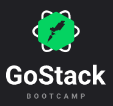

# Desafios - GoStack Bootcamp | [Rocketseate](https://rocketseat.com.br/)

## Table of Contents

- [About](#about)
- [Getting Started](#getting_started)
- [Usage](#usage)

## About 

Repositório dos desafios do curso: GoStack Bootcamp

## Getting Started 

...
### Prerequisites

* Gerenciador de pacotes:
  * NPM
  * Yarn
* NodeJS
* ReactJS
* React Native
* JDK8
* Android Studio e dependências

### Installing

...
## Usage 

